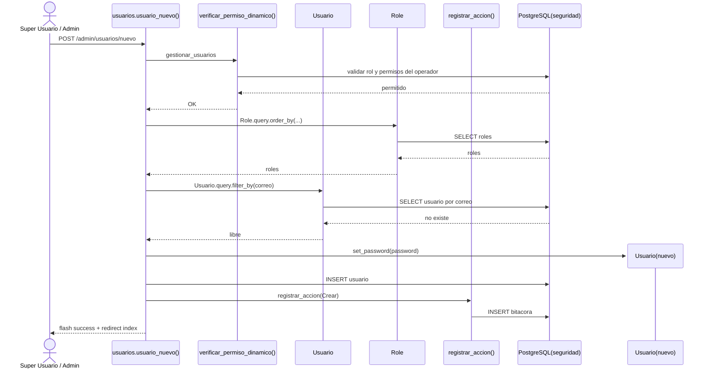
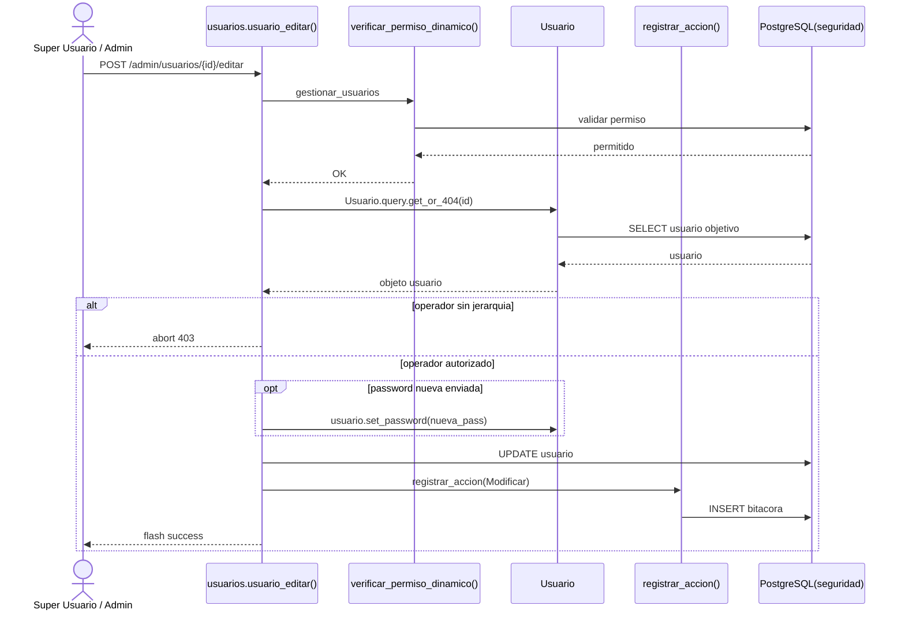
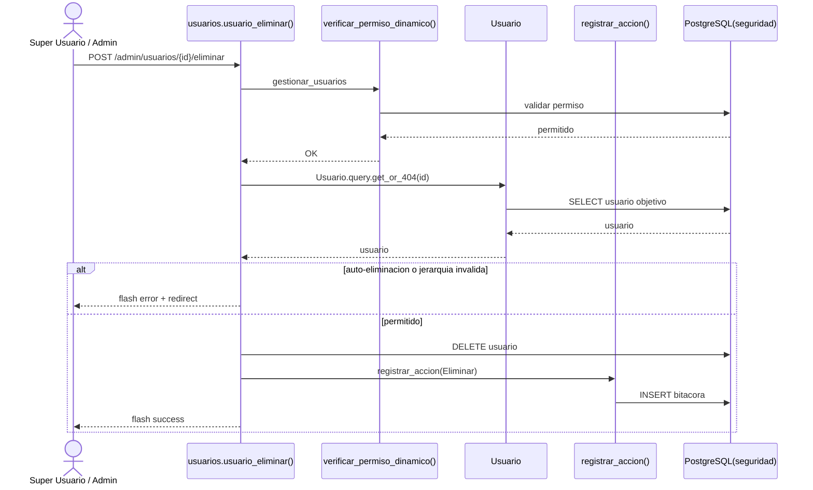
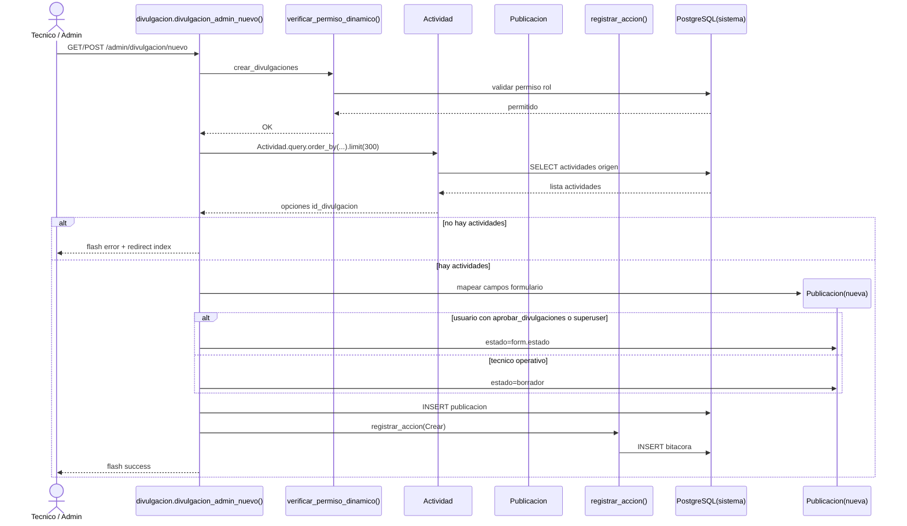
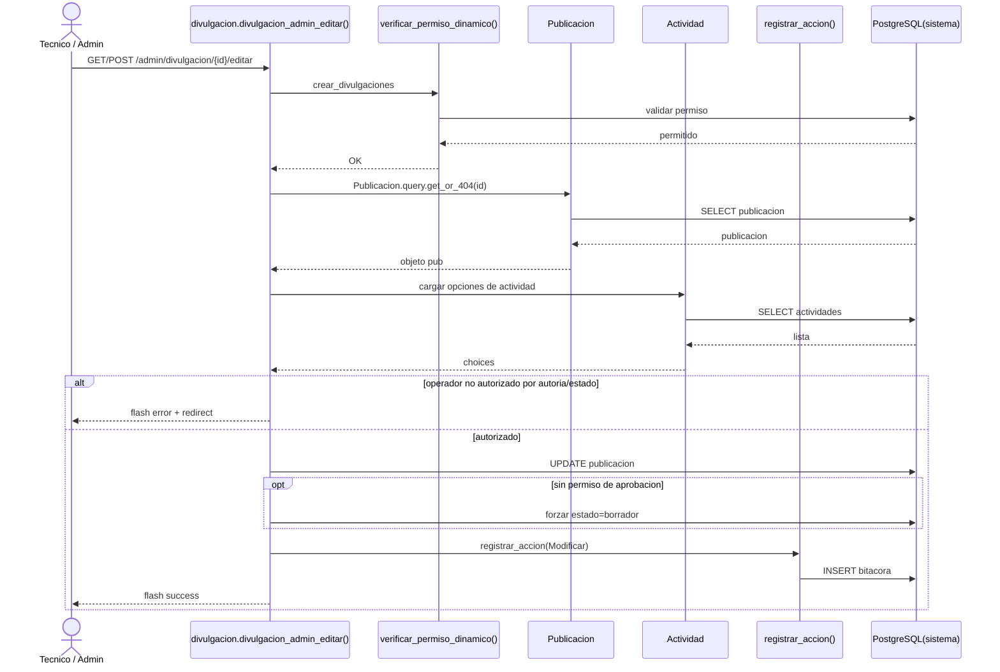
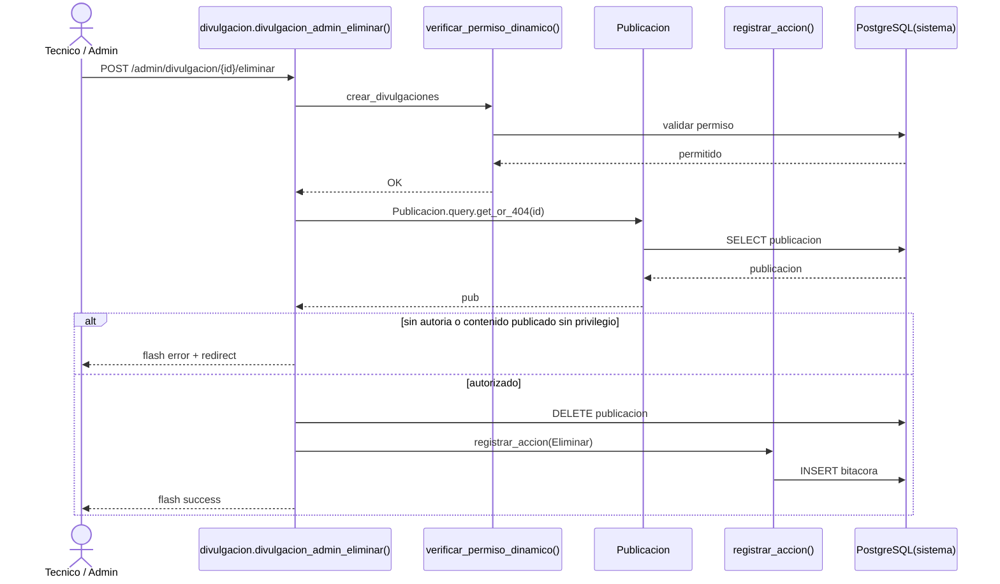

# Diagramas de Secuencia - Modulos Core ONCC

Este documento contiene 8 diagramas de secuencia alineados al codigo real de los modulos:

- Gestion de Usuarios (4)
- Divulgacion (4)

Nota metodologica:
- No se incluyen vistas (HTML) como objetos del diagrama.
- Se modelan actor, controlador, servicios, modelos y base de datos.
- Se usa destroy cuando el objeto temporal termina su funcion en el flujo.

## Modulo: Gestion de Usuarios

### 1) Registrar Nuevo Usuario



### 2) Modificar Usuario



### 3) Eliminar Usuario



### 4) Gestionar Permisos de Rol (Control de Acceso)

```mermaid
sequenceDiagram
    actor SU as Super Usuario / Admin
    participant RCtrl as roles.rol_gestionar_permisos()
    participant AuthZ as verificar_permiso_dinamico()
    participant Role as Role
    participant Pivot as Permiso
    participant Perm as Permission
    participant Audit as registrar_accion()
    participant DB as PostgreSQL(seguridad)

    SU->>RCtrl: POST /admin/roles/{rol_id}/permisos
    RCtrl->>AuthZ: gestionar_usuarios
    AuthZ->>DB: validar permiso
    DB-->>AuthZ: permitido
    AuthZ-->>RCtrl: OK

    RCtrl->>Role: Role.query.get_or_404(rol_id)
    Role->>DB: SELECT rol
    DB-->>Role: rol
    Role-->>RCtrl: rol

    RCtrl->>Perm: Permission.query.order_by(...)
    Perm->>DB: SELECT modulos
    DB-->>Perm: lista permisos
    Perm-->>RCtrl: permisos

    RCtrl->>Pivot: Permiso.query.filter_by(id_rol).delete()
    Pivot->>DB: DELETE pivote permisos
    loop por cada permiso seleccionado
        create participant Rel as Permiso(new)
        RCtrl->>Rel: construir relacion id_rol-id_modulo
        RCtrl->>DB: INSERT pivote
        destroy Rel
    end

    RCtrl->>Audit: registrar_accion(ActualizarPermisos)
    Audit->>DB: INSERT bitacora
    RCtrl-->>SU: flash success
```

## Modulo: Divulgacion

### 1) Crear Publicacion



### 2) Editar Publicacion



### 3) Aprobar Publicacion

```mermaid
sequenceDiagram
    actor AD as Admin aprobador
    participant DCtrl as divulgacion.divulgacion_admin_aprobar()
    participant AuthZ as verificar_permiso_dinamico()
    participant Pub as Publicacion
    participant Notify as ServicioNotificacion
    participant Audit as registrar_accion()
    participant DB as PostgreSQL(sistema)

    AD->>DCtrl: POST /admin/divulgacion/{id}/aprobar
    DCtrl->>AuthZ: aprobar_divulgaciones
    AuthZ->>DB: validar permiso
    DB-->>AuthZ: permitido
    AuthZ-->>DCtrl: OK

    DCtrl->>Pub: Publicacion.query.get_or_404(id)
    Pub->>DB: SELECT publicacion
    DB-->>Pub: publicacion
    Pub-->>DCtrl: pub

    DCtrl->>DB: UPDATE estado_publicacion=publicado, publicado_en=utcnow
    DCtrl->>Notify: disparar_a_main_page(pub)
    create participant Event as PublicacionEvento
    Notify-->>Event: construir payload de notificacion
    destroy Event
    DCtrl->>Audit: registrar_accion(Modificar)
    Audit->>DB: INSERT bitacora
    DCtrl-->>AD: flash success
```

### 4) Eliminar Publicacion


